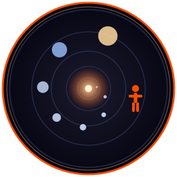

# universe



**Every scale there is, one step at a time. From the quantum foam to the cosmic web, in your terminal.**

   

universe opens on a human body and steps outwards or inwards. Thirty-seven rungs, each a picture of what that scale holds:

- A proton, a virus, an ant, a whale, a city at night.
- The Sun, with Earth beside it to scale.
- The Milky Way, with the Sun marked two thirds of the way out.
- The web of galaxies, at the end.

A ruler along the bottom shows where you stand, over every power of ten from 10⁻³⁵ metres to 10²⁷. Part of the [Fe₂O₃ Rust terminal suite](https://github.com/isene/fe2o3).

You are almost exactly halfway. That is the point of the app.

## Keys

| Key | Does |
|---|---|
| `↑` `↓`, `k` `j`, `+` `-` | Step out and step in |
| `PgUp` / `PgDn` | Five rungs at a time |
| `H` | Back to the human body |
| `g` / `G` | The smallest and the largest |
| `q` | Quit |

The rung you were on is remembered in `~/.universe`, so the app opens where you left it.

## The pictures

Every scene is painted into one buffer of pixels, whatever the terminal can show. A terminal with the kitty graphics protocol gets those pixels as they are. One without gets the same picture as coloured half-blocks, two rows per character cell, so the shapes survive.

Nothing moves by itself. A picture is painted when you change rung or resize the window, and sitting on one scale costs nothing at all.

## Reading the ruler

The bar along the bottom runs over every power of ten from 10⁻³⁵ metres to 10²⁷. The diamond is where you are.

The size in the top bar is the thing itself, not the picture. Earth's orbit reads 1 AU, and Everest reads 8.85 km. Each picture is wider than its thing, so there is room around it.

## The photographs

Twelve rungs use a real picture rather than a drawing, because nobody draws these better than a camera did. All are public domain.

They come in two kinds, and each kind keeps to its own part of the ladder. The four living things are white line work on black. Everything from a mountain upwards is a photograph.

| Rung | Picture |
|---|---|
| Ant | Pearson Scott Foresman, an engraved worker ant |
| Human hand | a CC0 photograph, reduced to line work |
| Human body | NASA, the two figures from the Pioneer plaque |
| Blue whale | Pearson Scott Foresman, an engraving |
| Mount Everest | NASA, the Himalaya from orbit |
| City at night | NASA, New York from the space station |
| Coastline from orbit | NASA MODIS, Scandinavia in spring |
| The Moon | NASA LRO, the same height map the `moon` app uses |
| The Earth | NASA, the Blue Marble from Apollo 17 |
| Jupiter | NASA and the Hubble telescope |
| The Sun | NASA, the Solar Dynamics Observatory |
| The Milky Way | NASA and JPL-Caltech, how our galaxy looks from outside |

Each picture is decoded once and kept. The last three rungs you looked at are kept whole, so stepping back is instant.

## Command line

```bash
universe            # open where you left off
universe 24         # open on rung 24, the Sun
universe -l         # list every rung and its size
universe --png 32 milkyway.png 160 44   # a rung as a picture file
```

## Install

```bash
cargo install --path .
```

Or clone the [Fe₂O₃ suite](https://github.com/isene/fe2o3) beside it and build there.

## Files

- `~/.universe`: the rung you were on last, one number.

## License

Public domain. Do what you like with it.
